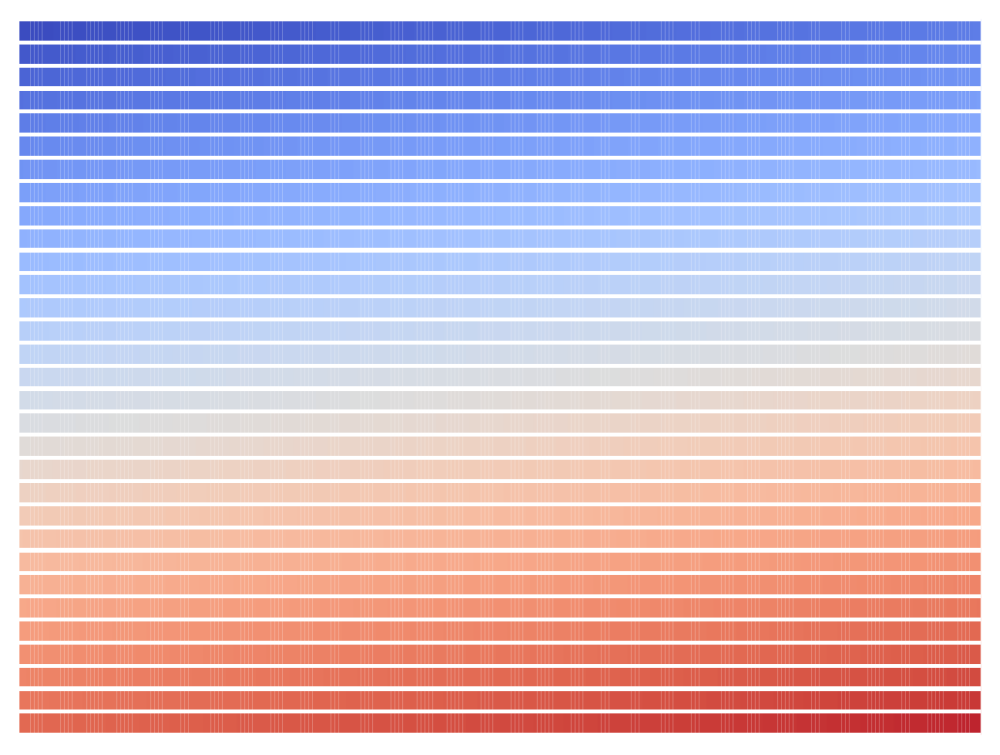
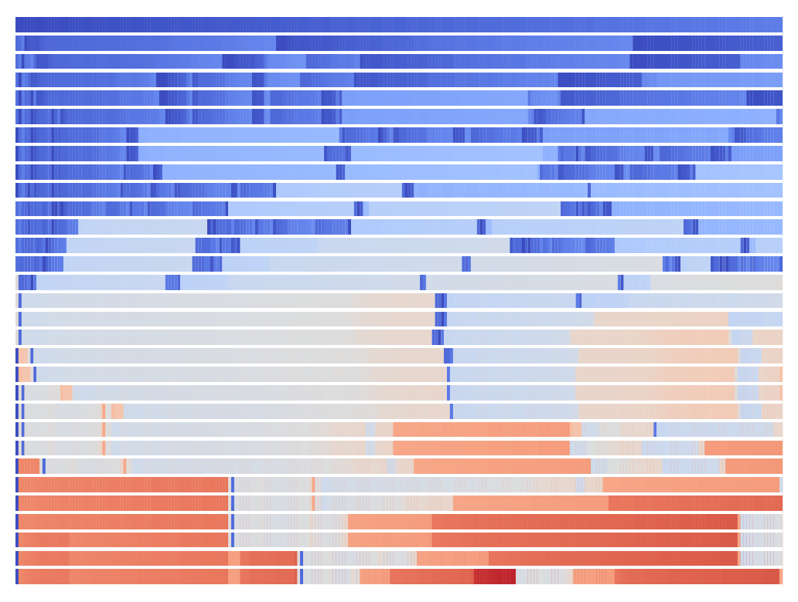
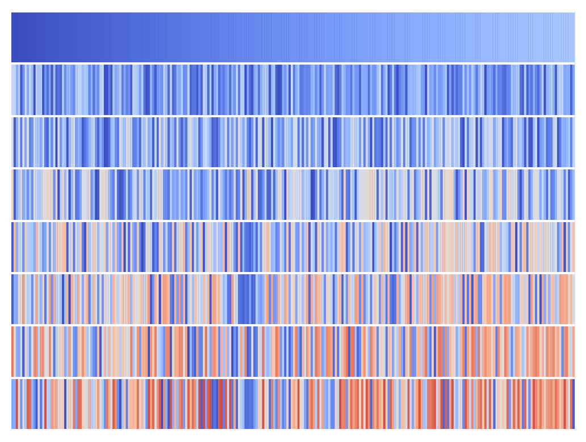

# Back from the Future: Key-Value Cache Management by Counter-Causal Surprise

A simple yet effective KV cache eviction scheme motivated by the insight that past tokens which can be well-predicted from more recent tokens are redundant and their associated keys and values can be removed from the cache. To score entries for eviction we run the model on the tokens in their original order, reusing the key and value representations already stored in the KV cache, and applying a counter-causal attention mask so that each position attends only to its future context. This is in-distribution, tied directly to the actual cache contents, and requires no additional training.

<table>
  <tr>
    <td></td>
    <td></td>
    <td></td>
  </tr>
  <tr>
    <td align="center">(a) Sliding window</td>
    <td align="center">(b) Attention-based importance</td>
    <td align="center">(c) Counter-causal surprise</td>
  </tr>
</table>

## Install

```bash
python -m venv ~/venvs/cc_kv
source ~/venvs/cc_kv/bin/activate
pip install -r requirements.txt
```

GPU with at least 16GB VRAM recommended (tested on RTX 4090, PyTorch 2.10.0+cu128).

## Files

| File          | Contents                                                           |
|---------------|--------------------------------------------------------------------|
| `hooks.py`    | `CacheState`, `generate_with_kv_hook`, all KV cache hook factories |
| `tasks.py`    | Task runners: MATH500, LongHealth, QASPER, LoCoMo                  |
| `evaluate.py` | CLI entry point -- loads model, builds hook, dispatches to task    |

## Hooks

| `--hook`         | Description                                                                        |
|------------------|------------------------------------------------------------------------------------|
| `none`           | Full KV cache (no eviction)                                                        |
| `sliding`        | Keep the most recent `cache_size` tokens                                           |
| `importance`     | Evict lowest-importance tokens (last-layer key similarity)                         |
| `h2o`            | Heavy-Hitter Oracle (Zhang et al., 2023)                                           |
| `counter_causal` | Counter-causal surprise -- full L-layer pass reusing cached K/V **(ours)**         |
| `counter_fast`   | Counter-causal surprise -- single last-layer approximation **(ours, 7-9x faster)** |

## Usage

### MATH500

```bash
# Full cache (baseline)
python evaluate.py --task math500 --hook none --out results_none.json

# Counter-causal (full, cached K/V reuse)
python evaluate.py --task math500 --hook counter_causal \
    --cache_size 512 --chunk_size 256 --out results_cached.json

# Counter-causal (fast single-layer approximation)
python evaluate.py --task math500 --hook counter_fast \
    --cache_size 512 --chunk_size 256 --out results_fast.json

# Sweep all hooks across models
for MODEL in Qwen/Qwen2.5-3B-Instruct Qwen/Qwen2.5-7B-Instruct Qwen/Qwen2.5-14B-Instruct \
             meta-llama/Meta-Llama-3.1-8B-Instruct; do
    for HOOK in none sliding importance h2o counter_causal counter_fast; do
        python evaluate.py --task math500 --model $MODEL \
            --hook $HOOK --cache_size 512 --chunk_size 256 \
            --out results_math500_${MODEL##*/}_${HOOK}.json
    done
done
```

### LongHealth

```bash
python evaluate.py --task longhealth --hook counter_fast \
    --cache_size 4096 --chunk_size 1024 --out results_longhealth.json
```

### QASPER

```bash
python evaluate.py --task qasper --hook counter_fast \
    --cache_size 4096 --chunk_size 1024 --out results_qasper.json
```

### LoCoMo

```bash
# All categories
python evaluate.py --task locomo --hook counter_fast \
    --cache_size 4096 --chunk_size 1024 --out results_locomo.json

# Single category (1=single-hop F1, 5=adversarial)
python evaluate.py --task locomo --hook counter_fast --category 1 \
    --cache_size 4096 --chunk_size 1024 --out results_locomo_cat1.json

# Use a local copy of locomo10.json instead of downloading
python evaluate.py --task locomo --hook counter_fast \
    --data_path /path/to/locomo10.json --out results_locomo.json
```

## Key arguments

| Argument          | Default                        | Description |
|-------------------|--------------------------------|-------------|
| `--model`         | `Qwen/Qwen2.5-7B-Instruct`     | HuggingFace model ID |
| `--cache_size`    | 512 (math500), 4096 (others)   | Maximum KV cache size |
| `--chunk_size`    | `cache_size // 4`              | Tokens processed between hook calls |
| `--recent_size`   | 0 (or `cache_size//2` for h2o) | Trailing tokens kept without scoring |
| `--frozen_size`   | 0                              | Leading tokens never evicted |
| `--auto_frozen`   | --                             | Infer `frozen_size` from the task system prompt |
| `--refresh_mode`  | `chunked`                      | `chunked`: fire every chunk; `prefill_end`: fire once after prefill |
| `--single_sample` | --                             | Run on one dataset sample (for debugging) |

## Using hooks programmatically

```python
import torch
from transformers import AutoTokenizer, AutoModelForCausalLM
from hooks import counter_causal_fast_hook, generate_with_kv_hook

tokenizer = AutoTokenizer.from_pretrained("Qwen/Qwen2.5-7B-Instruct")
model = AutoModelForCausalLM.from_pretrained(
    "Qwen/Qwen2.5-7B-Instruct", dtype=torch.float16, device_map="cuda"
)
model.eval()

hook = counter_causal_fast_hook(model, cache_size=512)

inputs = tokenizer("Tell me about counter-causal reasoning.", return_tensors="pt").to("cuda")
output = generate_with_kv_hook(model, tokenizer, inputs.input_ids,
                                max_new_tokens=256, chunk_size=128, kv_hook=hook)
print(output)
```
